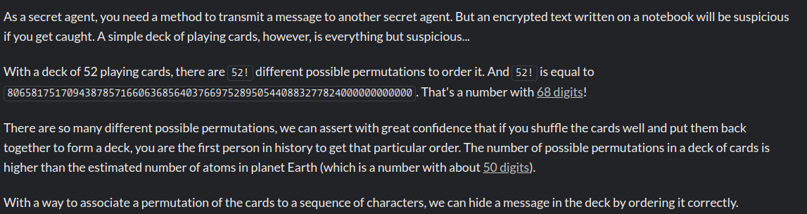
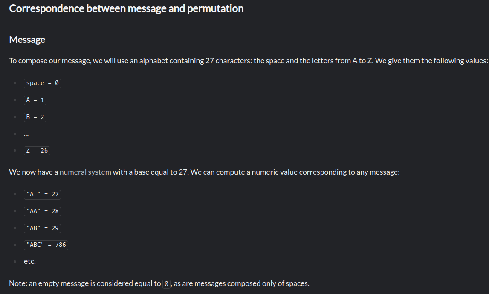
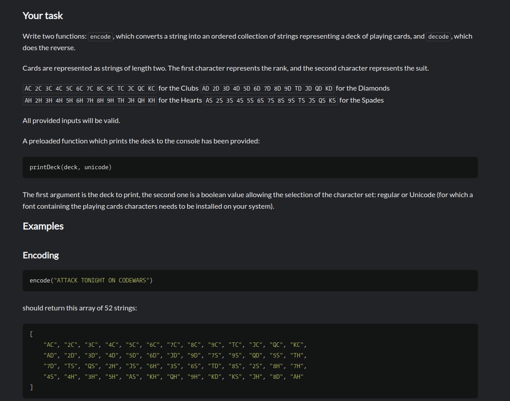
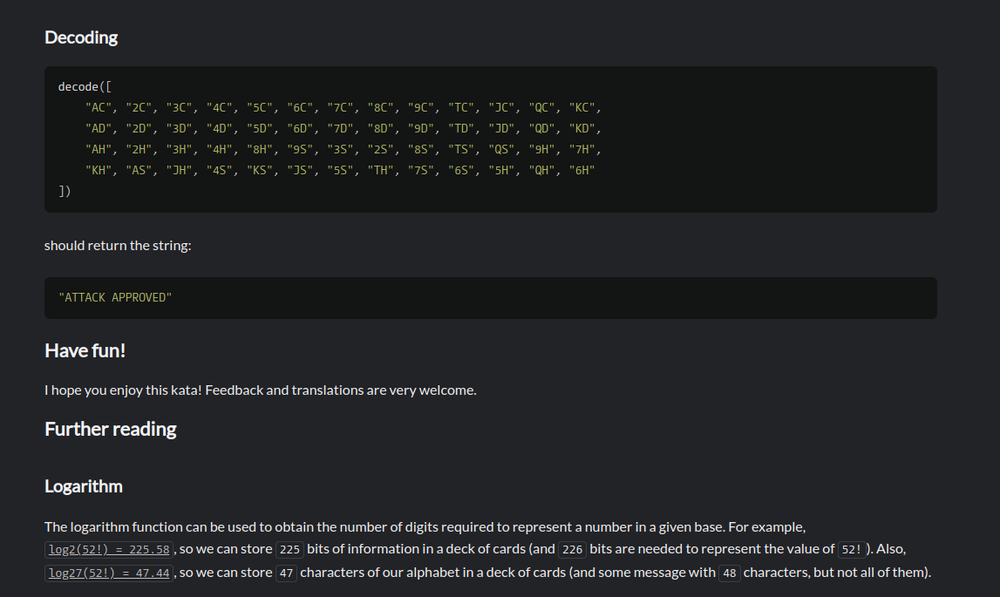

# 🎴 Playing Cards Encoding and Decoding

This repository contains a class `PlayingCards` that provides functionality for encoding and decoding messages using a standard deck of playing cards. The class uses permutations and number transformations to achieve this.

## 📝 Challenge Description







## 💡 Method Descriptions

### `message_to_number(message)`

Converts a string message into a number based on its characters.

**Parameters:**
- `message` (str): The message to convert.

**Returns:**
- `int`: The numerical representation of the message.

### `number_to_message(n)`

Converts a number back into a string message.

**Parameters:**
- `n` (int): The number to convert.

**Returns:**
- `str`: The string representation of the number.

### `number_to_permutation(n, elements)`

Converts a number into a permutation of elements.

**Parameters:**
- `n` (int): The number to convert.
- `elements` (list): The list of elements to permute.

**Returns:**
- `list`: The permutation of elements.

### `permutation_to_number(permutation, elements)`

Converts a permutation of elements back into a number.

**Parameters:**
- `permutation` (list): The permutation to convert.
- `elements` (list): The list of elements.

**Returns:**
- `int`: The number representation of the permutation.

### `encode(message)`

Encodes a message into a permutation of playing cards.

**Parameters:**
- `message` (str): The message to encode.

**Returns:**
- `list`: The permutation of playing cards.

### `decode(deck)`

Decodes a permutation of playing cards back into a message.

**Parameters:**
- `deck` (list): The permutation of playing cards.

**Returns:**
- `str`: The decoded message.

**Note:** This method also prints the deck in both regular and Unicode formats.

## 📚 Code Implementation

```python
import math

class PlayingCards:
    def __init__(self):
        # Define the standard deck of 52 cards
        self.cards = [
            'AC', '2C', '3C', '4C', '5C', '6C', '7C', '8C', '9C', 'TC', 'JC', 'QC', 'KC',
            'AD', '2D', '3D', '4D', '5D', '6D', '7D', '8D', '9D', 'TD', 'JD', 'QD', 'KD',
            'AH', '2H', '3H', '4H', '5H', '6H', '7H', '8H', '9H', 'TH', 'JH', 'QH', 'KH',
            'AS', '2S', '3S', '4S', '5S', '6S', '7S', '8S', '9S', 'TS', 'JS', 'QS', 'KS'
        ]
        # Alphabet mapping
        self.alphabet = ' ABCDEFGHIJKLMNOPQRSTUVWXYZ'
        self.char_to_value = {char: i for i, char in enumerate(self.alphabet)}
        self.value_to_char = {i: char for i, char in enumerate(self.alphabet)}

    def message_to_number(self, message):
        num = 0
        for char in message:
            num = num * 27 + self.char_to_value[char]
        return num

    def number_to_message(self, n):
        if n == 0:
            return ''
        message = []
        while n > 0:
            n, rem = divmod(n, 27)
            message.append(self.value_to_char[rem])
        message.reverse()
        return ''.join(message)

    def number_to_permutation(self, n, elements):
        permutation = []
        k = len(elements)
        elements = list(elements)  # Make a mutable copy
        for i in range(k):
            fact = math.factorial(k - 1 - i)
            index = n // fact
            n = n % fact
            permutation.append(elements.pop(index))
        return permutation

    def permutation_to_number(self, permutation, elements):
        elements = list(elements)  # Make a mutable copy
        n = 0
        k = len(elements)
        for i in range(k):
            fact = math.factorial(k - 1 - i)
            index = elements.index(permutation[i])
            n += index * fact
            elements.pop(index)
        return n

    def encode(self, message):
        num = self.message_to_number(message)
        return self.number_to_permutation(num, self.cards)

    def decode(self, deck):
        # Print the deck in both regular and unicode formats
        printDeck(deck, True)  # Using unicode characters
        printDeck(deck, False)  # Using regular characters

        num = self.permutation_to_number(deck, self.cards)
        return self.number_to_message(num)
```