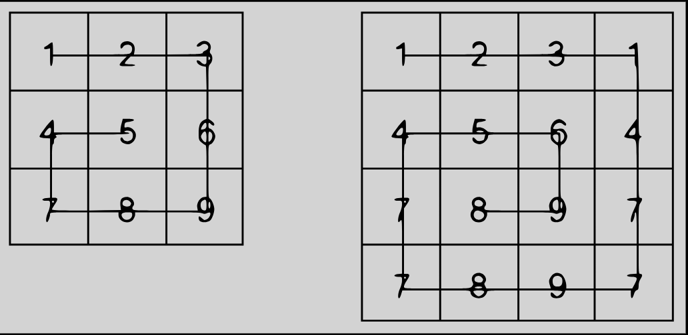

# 🐌 Snail

This repository contains a solution to the **Snail Sort** problem, which involves traversing a 2D array in a spiral (or snail) order. 

## 📝 Problem Description

Given an n x n array, return the array elements arranged from outermost elements to the middle element, traveling clockwise.

```
array = [[1,2,3],
         [4,5,6],
         [7,8,9]]
snail(array) #=> [1,2,3,6,9,8,7,4,5]
```

For better understanding, please follow the numbers of the next array consecutively:

```
array = [[1,2,3],
         [8,9,4],
         [7,6,5]]
snail(array) #=> [1,2,3,4,5,6,7,8,9]
```
This image will illustrate things more clearly:




## 💡 Solution

The solution involves iterating over the matrix in a spiral order by adjusting the boundaries (`row_begin`, `row_end`, `col_begin`, and `col_end`) as we traverse each layer of the matrix.

### Approach

1. **Initialize Boundaries**:
   - `row_begin` and `row_end` track the current row boundaries.
   - `col_begin` and `col_end` track the current column boundaries.
2. **Traverse Layers**:
   - Traverse from left to right across the top boundary.
   - Traverse from top to bottom down the right boundary.
   - Traverse from right to left across the bottom boundary.
   - Traverse from bottom to top up the left boundary.
   - Adjust the boundaries and repeat until the entire matrix is traversed.

### Code Implementation

```python
def snail(arr):
    res = []
    if len(arr) == 0:
        return False
    
    row_begin = 0
    row_end = len(arr) - 1
    col_begin = 0
    col_end = len(arr[0]) - 1 
    
    while row_begin <= row_end and col_begin <= col_end:
        for i in range(col_begin, col_end + 1):
            #print(arr[row_begin][i])
            res.append(arr[row_begin][i])
        row_begin += 1
        
        for i in range(row_begin, row_end + 1):
            #print(arr[i][col_end])
            res.append(arr[i][col_end])
        col_end -= 1
        
        if row_begin <= row_end:
            for i in range(col_end, col_begin - 1, -1):
                #print(arr[row_end][i])
                res.append(arr[row_end][i])
        row_end -= 1
        
        if col_begin <= col_end:
            for i in range(row_end, row_begin - 1, -1):
                #print(arr[i][col_begin])
                res.append(arr[i][col_begin])
        col_begin += 1
        
    return res
```

### How It Works

- **Initialization**:
  - Set the initial boundaries for rows and columns.
- **Traversal**:
  - Process each boundary in the spiral order.
  - Adjust the boundaries after processing each layer.
- **Completion**:
  - Continue until all layers are processed.
